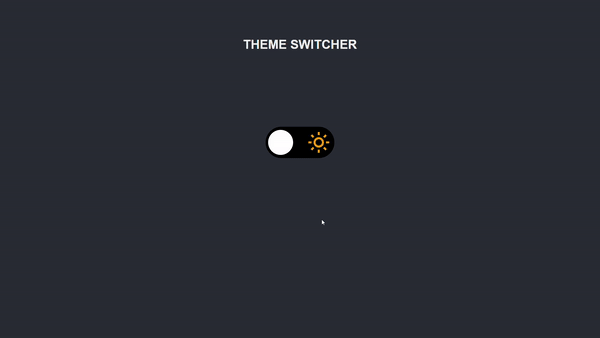

<h1 align="center">
    Theme Switcher ☀️/🌙
</h1>

<div align="center">
   <a href="https://github.com/JohnPetros">
      
   </a>
   
   <a href="https://github.com/JohnPetros/theme-switcher/commits/main">
      
   </a>
  </a>
   </a>
   <a href="https://github.com/JohnPetros/theme-switcher/blob/main/LICENSE.md">
      
   </a>
    
</div>

<br>

## 🖥️ Projeto

Página estática com um **theme switcher** centralizado na tela, ou seja, um botão que permite trocar as cores de um site com tonalidades claras para tonalidades escuras. Projeto desenvolvido como desafio durante o Discover, que é um programa promovido pela **@Rocketseat** voltado para o ensino de programação web para iniciantes.

### Demonstração
<div align="center">
    
</div>

---
<br>

## ✨ Funcionalidades

- [x] Trocar de tema de cores tanto do texto quando do background da página ao clicar no switcher
- [x] Ter uma transição entre um ícone de sol (representando o tema light) e um de lua (representando o tema dark) 
- [x] Armazenar o tema atual no local storage, de modo que as cores permaneçam na página mesmo se usuário regarregar a página

---
<br>


##  Tecnologias

Esse projeto foi desenvolvido com as seguintes tecnologias:

✔️ **[JavaScript](https://developer.mozilla.org/pt-BR/docs/Web/JavaScript)**

✔️ **[CSS](https://developer.mozilla.org/pt-BR/docs/Web/CSS)**

✔️ **[HTML](https://developer.mozilla.org/pt-BR/docs/Web/HTML)**

---
<br>

## 🚀 Como rodar este projeto

### Pré-requesitos

Embora não seja obrigatório, para rodar a aplicação de uma forma mais prática, é bom ter o editor de código [VSCode](https://code.visualstudio.com/) junto com a extensão [Live Server](https://marketplace.visualstudio.com/items?itemName=ritwickdey.LiveServer), que pode ser instalada no marketplace do próprio VSCode. 

#### 📟 Rodando a aplicação

```bash

# Clone este repositório no terminal/cmd
$ git clone https://github.com/JohnPetros/theme-switcher.git

# Acesse a pasta do projeto
$ cd theme-switcher

# Abra a pasta no VSCode
$ code .

# Execute o arquivo index com a extensão Live Server, clicando com o botão direito sobre ele e depois em Open with Live Server

```

---
<br>

## ⚙️ Deploy

O deploy desse projeto foi realizado através do **[Github Pages](https://www.infinityfree.net/)**. Isso implica que você pode acessar o projeto funcionando acessando esse **[link](https://johnpetros.github.io/super-trunfo-clash-royale/)**

---
<br>

## 🎨 Layout:
No link abaixo você encontra o layout do projeto feito pela equipe da Rocketseat. Lembrando que você precisa ter uma conta no [Figma](http://figma.com/) para acessá-lo.

- [Layout](https://www.figma.com/file/faqMNLrCBeIWJt9tXrRUpX/DD-Theme-Switcher-Copy?fuid=1063607431262423232)

---
<br>

## 📝 Licença

Esse projeto está sob a licença MIT. Veja o arquivo [LICENSE](LICENSE) para mais detalhes.

---

<p align="center">
   Feito com 💜 by John Petros 👋🏻
</p>
